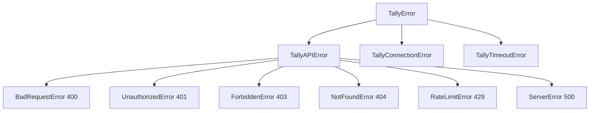

# Error Handling

The PyTally SDK provides comprehensive error handling with specific exception types for different error scenarios. This guide explains how to handle errors effectively in your application.

## Exception Hierarchy

All exceptions inherit from [`TallyError`](#tallyerror):



## Exception Types

### TallyError

Base exception for all Tally SDK errors.

**Attributes:**

- `message` (str): Error message
- `status_code` (int | None): HTTP status code (if applicable)

### TallyAPIError

Raised when the API returns an error response.

**Attributes:**

- `message` (str): Error message
- `status_code` (int): HTTP status code
- `response` (dict | None): Full error response from API
- `error_type` (str | None): Error type from API
- `errors` (list): List of detailed error objects

**Example:**

```python
from tally import Tally, TallyAPIError

client = Tally(api_key="tly_your_api_key_here")

try:
    form = client.forms.create(name="", workspace_id="invalid")
except TallyAPIError as e:
    print(f"Error: {e.message}")
    print(f"Status: {e.status_code}")
    print(f"Type: {e.error_type}")
    if e.errors:
        for error in e.errors:
            print(f"  - {error}")
```

### BadRequestError (400)

Raised when the request is malformed or contains invalid parameters.

**Common causes:**

- Missing required parameters
- Invalid parameter values
- Malformed JSON
- Invalid form block structure

**Example:**

```python
from tally import Tally, BadRequestError

client = Tally(api_key="tly_your_api_key_here")

try:
    # Missing required 'name' parameter
    form = client.forms.create(workspace_id="wXYz123")
except BadRequestError as e:
    print(f"Bad request: {e.message}")
    # Handle validation errors
    for error in e.errors:
        field = error.get("field")
        message = error.get("msg")
        print(f"  - {field}: {message}")
```

### UnauthorizedError (401)

Raised when authentication credentials are missing or invalid.

**Common causes:**

- Invalid API key
- Expired API key
- Missing API key
- Revoked API key

**Example:**

```python
from tally import Tally, UnauthorizedError

try:
    client = Tally(api_key="invalid_key")
    user = client.users.me()
except UnauthorizedError:
    print("Authentication failed. Please check your API key.")
    # Prompt user to enter valid API key or refresh credentials
```

### ForbiddenError (403)

Raised when you don't have permission to access a resource.

**Common causes:**

- Trying to access another organization's resources
- Insufficient permissions
- Resource access restricted

**Example:**

```python
from tally import Tally, ForbiddenError

client = Tally(api_key="tly_your_api_key_here")

try:
    # Trying to access a form from a different organization
    form = client.forms.get(form_id="wXYz123")
except ForbiddenError:
    print("Access denied. You don't have permission to access this resource.")
```

### NotFoundError (404)

Raised when the requested resource doesn't exist.

**Common causes:**

- Invalid resource ID
- Resource has been deleted
- Typo in resource ID

**Example:**

```python
from tally import Tally, NotFoundError

client = Tally(api_key="tly_your_api_key_here")

try:
    form = client.forms.get(form_id="nonexistent")
except NotFoundError:
    print("Form not found. Please check the form ID.")
```

### RateLimitError (429)

Raised when you've exceeded the allowed number of requests.

**Common causes:**

- Too many requests in a short time period
- Exceeding API rate limits

**Example:**

```python
from tally import Tally, RateLimitError
import time

client = Tally(api_key="tly_your_api_key_here")

def get_form_with_retry(form_id: str, max_retries: int = 3):
    """Get form with automatic retry on rate limit."""
    for attempt in range(max_retries):
        try:
            return client.forms.get(form_id=form_id)
        except RateLimitError as e:
            if attempt < max_retries - 1:
                wait_time = 2 ** attempt  # Exponential backoff
                print(f"Rate limited. Waiting {wait_time}s before retry...")
                time.sleep(wait_time)
            else:
                raise  # Re-raise if all retries exhausted
```

### ServerError (500)

Raised when something goes wrong on Tally's end.

**Common causes:**

- Temporary server issues
- Service unavailability
- Internal server errors

**Example:**

```python
from tally import Tally, ServerError
import time

client = Tally(api_key="tly_your_api_key_here")

try:
    forms = client.forms.all()
except ServerError as e:
    print(f"Server error: {e.message}")
    print("The issue is on Tally's side. Please try again later.")
    # Implement retry logic or notify monitoring system
```

### TallyConnectionError

Raised when there's a connection error to the Tally API.

**Common causes:**

- Network connectivity issues
- DNS resolution failures
- Firewall blocking requests

**Example:**

```python
from tally import Tally, TallyConnectionError

client = Tally(api_key="tly_your_api_key_here")

try:
    user = client.users.me()
except TallyConnectionError as e:
    print(f"Connection error: {e.message}")
    print("Please check your internet connection.")
```

### TallyTimeoutError

Raised when a request to the Tally API times out.

**Common causes:**

- Slow network connection
- Large data transfers
- API performance issues

**Example:**

```python
from tally import Tally, TallyTimeoutError

# Increase timeout for slow connections
client = Tally(
    api_key="tly_your_api_key_here",
    timeout=60.0  # 60 seconds
)

try:
    submissions = client.forms.list_submissions(
        form_id="wXYz123",
        limit=100
    )
except TallyTimeoutError:
    print("Request timed out. Try increasing the timeout value.")
```

## Best Practices

### 1. Catch Specific Exceptions

Always catch the most specific exception first:

```python
from tally import (
    Tally,
    UnauthorizedError,
    NotFoundError,
    RateLimitError,
    TallyAPIError,
    TallyConnectionError
)

client = Tally(api_key="tly_your_api_key_here")

try:
    form = client.forms.get(form_id="wXYz123")
except UnauthorizedError:
    # Handle authentication errors
    print("Invalid API key")
except NotFoundError:
    # Handle missing resources
    print("Form not found")
except RateLimitError:
    # Handle rate limiting
    print("Rate limited - slow down requests")
except TallyAPIError as e:
    # Handle other API errors
    print(f"API error: {e.message}")
except TallyConnectionError:
    # Handle connection errors
    print("Connection failed")
```

### 2. Use Context Managers

Ensure proper cleanup even when errors occur:

```python
from tally import Tally, TallyAPIError

try:
    with Tally(api_key="tly_your_api_key_here") as client:
        forms = client.forms.all()
        # Process forms...
except TallyAPIError as e:
    print(f"Error: {e.message}")
# Client is automatically closed even if error occurs
```

## Debugging Tips

### Enable Detailed Error Information

Check the full error response for debugging:

```python
from tally import Tally, TallyAPIError

client = Tally(api_key="tly_your_api_key_here")

try:
    form = client.forms.create(name="Test")
except TallyAPIError as e:
    print("=== Error Details ===")
    print(f"Message: {e.message}")
    print(f"Status Code: {e.status_code}")
    print(f"Error Type: {e.error_type}")
    print(f"Response: {e.response}")
    print(f"Errors: {e.errors}")
```

### Test Error Scenarios

Test your error handling:

```python
from tally import Tally, NotFoundError

client = Tally(api_key="tly_your_api_key_here")

# Test with invalid ID to trigger NotFoundError
try:
    form = client.forms.get(form_id="invalid_id")
except NotFoundError:
    print("Error handling works correctly!")
```

## Next Steps

- 🏠 [Home](index.md) - Return to documentation home
- 📖 [API Reference](api-reference/users.md) - Explore API endpoints
- 🔑 [API Keys](api-keys.md) - Learn about API key management

## Reference

::: tally.exceptions
    options:
      show_source: false
      heading_level: 3